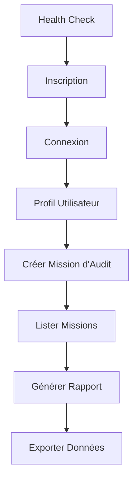

# 🚀 Guide Complet Postman - E-DEFENCE Audit Platform

Ce guide vous accompagne dans l'utilisation de Postman pour tester l'API de la plateforme E-DEFENCE Audit Platform.

## 📋 Table des Matières

1. [Prérequis](#prérequis)
2. [Installation](#installation)
3. [Configuration](#configuration)
4. [Déploiement avec Podman](#déploiement-avec-podman)
5. [Tests avec Postman](#tests-avec-postman)
6. [Tests Automatisés](#tests-automatisés)
7. [Dépannage](#dépannage)
8. [Bonnes Pratiques](#bonnes-pratiques)

## 🔧 Prérequis

### Logiciels Requis
- ✅ **Podman Desktop** (ou Docker Desktop)
- ✅ **Postman** (version 10.0+)
- ✅ **Node.js** (version 18+)
- ✅ **PowerShell** (Windows) ou **Bash** (Linux/macOS)

### Vérification des Prérequis
```powershell
# Vérifier Podman
podman --version

# Vérifier Node.js
node --version

# Vérifier npm
npm --version

# Vérifier PowerShell (Windows)
$PSVersionTable.PSVersion
```

## 📦 Installation

### 1. Installation de Newman (CLI Postman)
```powershell
# Installation globale de Newman
npm install -g newman

# Vérification
newman --version
```

### 2. Téléchargement des Fichiers Postman
Les fichiers sont déjà inclus dans le projet :
- `postman/E-DEFENCE_Audit_Platform.postman_collection.json`
- `postman/E-DEFENCE_Environment.postman_environment.json`

## ⚙️ Configuration

### 1. Import dans Postman

#### Méthode 1 : Interface Graphique
1. Ouvrir Postman
2. Cliquer sur **Import**
3. Glisser-déposer les fichiers :
   - `E-DEFENCE_Audit_Platform.postman_collection.json`
   - `E-DEFENCE_Environment.postman_environment.json`

#### Méthode 2 : Ligne de Commande
```powershell
# Importer la collection
newman run postman/E-DEFENCE_Audit_Platform.postman_collection.json --environment postman/E-DEFENCE_Environment.postman_environment.json
```

### 2. Configuration de l'Environnement

#### Variables Principales
| Variable | Valeur | Description |
|----------|--------|-------------|
| `base_url` | `http://localhost:5000` | URL de base de l'API |
| `test_email` | `test@e-defence.bf` | Email de test |
| `test_password` | `TestPassword123!` | Mot de passe de test |
| `access_token` | *(auto)* | Token JWT d'accès |
| `refresh_token` | *(auto)* | Token JWT de rafraîchissement |

#### Variables Dynamiques
- `user_id` : ID de l'utilisateur connecté
- `organization_id` : ID de l'organisation
- `audit_mission_id` : ID de la mission d'audit créée
- `file_id` : ID du fichier généré

## 🐳 Déploiement avec Podman

### 1. Déploiement Automatique
```powershell
# Déploiement complet
.\scripts\deploy-podman.ps1

# Déploiement sans reconstruction
.\scripts\deploy-podman.ps1 -SkipBuild

# Déploiement sans tests
.\scripts\deploy-podman.ps1 -SkipTests

# Déploiement avec nettoyage forcé
.\scripts\deploy-podman.ps1 -Force
```

### 2. Déploiement Manuel
```powershell
# 1. Vérifier les prérequis
.\scripts\test-ci.bat

# 2. Construire les images
podman build -t audit-platform-backend:latest ./backend

# 3. Démarrer les services
podman-compose up -d

# 4. Vérifier les services
podman-compose ps
```

### 3. Vérification du Déploiement
```powershell
# Health Check
curl http://localhost:5000/health

# Métriques
curl http://localhost:5000/metrics

# phpMyAdmin
curl http://localhost:8080
```

## 🧪 Tests avec Postman

### 1. Tests Manuels

#### Étape 1 : Inscription
1. Ouvrir la requête **"Inscription Utilisateur"**
2. Vérifier les données dans le body
3. Cliquer sur **Send**
4. Vérifier le code de réponse (201)

#### Étape 2 : Connexion
1. Ouvrir la requête **"Connexion Utilisateur"**
2. Cliquer sur **Send**
3. Vérifier que les tokens sont sauvegardés automatiquement

#### Étape 3 : Tests des Endpoints
1. **Health Check** : Vérifier l'état de l'API
2. **Profil Utilisateur** : Récupérer le profil
3. **Créer Mission d'Audit** : Créer une nouvelle mission
4. **Lister Missions** : Voir toutes les missions

### 2. Ordre Recommandé des Tests



### 3. Tests de Monitoring
- **Health Check** : `GET /health`
- **Health Check Détaillé** : `GET /health/detailed`
- **Métriques Prometheus** : `GET /metrics`
- **Statistiques d'Utilisation** : `GET /api/stats/usage`

## 🤖 Tests Automatisés

### 1. Tests avec Newman (CLI)
```powershell
# Tests complets
.\scripts\test-postman.ps1

# Tests avec verbose
.\scripts\test-postman.ps1 -Verbose

# Installation de Newman + Tests
.\scripts\test-postman.ps1 -InstallNewman
```

### 2. Tests Rapides
```powershell
# Test rapide de l'API
.\scripts\quick-test.ps1
```

### 3. Tests Spécifiques
```powershell
# Tests d'authentification uniquement
newman run postman/E-DEFENCE_Audit_Platform.postman_collection.json --folder "🔐 Authentification"

# Tests de monitoring uniquement
newman run postman/E-DEFENCE_Audit_Platform.postman_collection.json --folder "📈 Monitoring et Métriques"
```

### 4. Tests de Performance
```powershell
# Tests avec délais
newman run postman/E-DEFENCE_Audit_Platform.postman_collection.json --delay-request 1000

# Tests avec itérations
newman run postman/E-DEFENCE_Audit_Platform.postman_collection.json --iteration-count 5
```

## 📊 Rapports et Résultats

### 1. Rapports HTML
Les tests génèrent automatiquement des rapports HTML :
- `postman-test-report.html` : Rapport détaillé des tests
- `newman-report.html` : Rapport Newman standard

### 2. Interprétation des Résultats

#### Codes de Réponse
- **200** : Succès
- **201** : Créé avec succès
- **400** : Erreur de requête
- **401** : Non authentifié
- **403** : Non autorisé
- **404** : Ressource non trouvée
- **500** : Erreur serveur

#### Métriques de Performance
- **Temps de réponse** : < 2000ms
- **Taux de succès** : 100%
- **Erreurs** : 0

### 3. Exemples de Réponses

#### Succès (200)
```json
{
  "success": true,
  "data": {
    "id": 1,
    "email": "test@e-defence.bf",
    "firstName": "John",
    "lastName": "Doe"
  },
  "message": "Utilisateur récupéré avec succès"
}
```

#### Erreur (400)
```json
{
  "success": false,
  "error": {
    "code": "VALIDATION_ERROR",
    "message": "Email invalide",
    "details": ["email"]
  }
}
```

## 🚨 Dépannage

### 1. Problèmes Courants

#### API Non Accessible
```powershell
# Vérifier que les services sont démarrés
podman-compose ps

# Vérifier les logs
podman-compose logs backend

# Redémarrer les services
podman-compose restart
```

#### Erreurs d'Authentification
```powershell
# Vérifier les tokens
echo $env:access_token

# Se reconnecter
# 1. Supprimer les tokens dans l'environnement Postman
# 2. Relancer la requête "Connexion Utilisateur"
```

#### Erreurs de Base de Données
```powershell
# Vérifier la base de données
podman-compose exec database mysql -u audit_user -p audit_platform_saas

# Réinitialiser la base
podman-compose down -v
podman-compose up -d
```

### 2. Logs et Debugging

#### Logs Podman
```powershell
# Logs en temps réel
podman-compose logs -f

# Logs d'un service spécifique
podman-compose logs backend
```

#### Logs Postman
```powershell
# Mode verbose
newman run collection.json --verbose

# Logs détaillés
newman run collection.json --reporter-cli-no-summary
```

### 3. Réinitialisation Complète
```powershell
# Arrêter et nettoyer
podman-compose down -v
podman system prune -f

# Redéployer
.\scripts\deploy-podman.ps1 -Force
```

## 📚 Bonnes Pratiques

### 1. Organisation des Tests

#### Structure Recommandée
```
📁 Tests Postman
├── 🔐 Authentification
├── 👥 Gestion des Utilisateurs
├── 🏢 Gestion des Organisations
├── 📋 Missions d'Audit
├── 📊 Rapports et Export
├── 📈 Monitoring et Métriques
└── 🔧 Administration
```

#### Naming Convention
- **Requêtes** : Action + Ressource (ex: "Créer Mission d'Audit")
- **Variables** : snake_case (ex: `audit_mission_id`)
- **Environnements** : Nom + Environnement (ex: "E-DEFENCE - Development")

### 2. Gestion des Variables

#### Variables d'Environnement
- ✅ Utiliser des variables pour les URLs
- ✅ Séparer les environnements (dev, test, prod)
- ✅ Protéger les secrets (tokens, mots de passe)

#### Variables Dynamiques
- ✅ Sauvegarder automatiquement les IDs
- ✅ Utiliser les scripts de test pour la logique
- ✅ Valider les réponses avant de continuer

### 3. Tests Robustes

#### Validation des Réponses
```javascript
// Script de test
pm.test("Status code is 200", function () {
    pm.expect(pm.response.code).to.eql(200);
});

pm.test("Response has required fields", function () {
    const response = pm.response.json();
    pm.expect(response).to.have.property('success');
    pm.expect(response).to.have.property('data');
});
```

#### Gestion des Erreurs
```javascript
// Script de pré-requête
if (pm.environment.get('access_token')) {
    // Vérifier l'expiration du token
    const token = pm.environment.get('access_token');
    // Logique de rafraîchissement
}
```

### 4. Performance et Monitoring

#### Tests de Charge
```powershell
# Tests avec itérations
newman run collection.json --iteration-count 100 --delay-request 100
```

#### Monitoring Continu
```powershell
# Script de monitoring
while ($true) {
    .\scripts\quick-test.ps1
    Start-Sleep -Seconds 300  # 5 minutes
}
```

## 🔄 Workflow Complet

### 1. Développement
```powershell
# 1. Déployer l'application
.\scripts\deploy-podman.ps1

# 2. Tester manuellement
# Ouvrir Postman et tester les endpoints

# 3. Tests automatisés
.\scripts\test-postman.ps1

# 4. Vérifier les rapports
Start-Process postman-test-report.html
```

### 2. Intégration Continue
```powershell
# 1. Tests CI/CD
.\scripts\test-ci.bat

# 2. Déploiement
.\scripts\deploy-podman.ps1 -Environment production

# 3. Tests de régression
.\scripts\test-postman.ps1 -Verbose
```

### 3. Production
```powershell
# 1. Monitoring
.\scripts\monitoring.js

# 2. Tests de santé
.\scripts\quick-test.ps1

# 3. Rapports
.\scripts\generate-reports.ps1
```

## 📞 Support

### Ressources Utiles
- [Documentation Postman](https://learning.postman.com/)
- [Documentation Newman](https://learning.postman.com/docs/running-collections/using-newman-cli/)
- [Documentation Podman](https://docs.podman.io/)

### Contact
Pour toute question ou problème :
1. Vérifier les logs et les rapports
2. Consulter ce guide
3. Contacter l'équipe de développement

---

**Note** : Ce guide est régulièrement mis à jour. Vérifiez la version la plus récente dans le repository.


